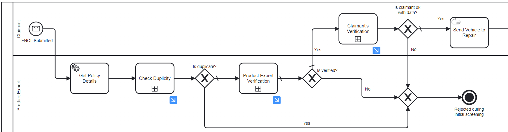

# Acheron's Claims Management System

## Introduction

Acheron's Claims Management System is an advanced workflow designed to streamline the insurance claims process using Camunda BPMN and DMN. The system automates key aspects of claims processing, including data validation, decision-making, and customer interactions. By leveraging both BPMN for workflow management and DMN for decision-making, the system ensures a high level of accuracy, efficiency, and compliance.

## Key Features of the Process

1. **Automated Initial Validation**: The system starts with an automated check of the submitted claims to ensure they meet the initial criteria for processing. This step reduces the workload on manual validators and speeds up the processing time by filtering out incomplete claims early in the process.

2. **Customer Interaction and Feedback Loop**: Whenever additional information is required from the customer, the system triggers an automated notification and waits for the response. This ensures that all necessary data is collected before further processing, minimizing errors and omissions.

3. **Dynamic Decision-Making with DMN**: Acheron's Claims Management System uses DMN tables to make complex decisions based on predefined rules. For example, the DMN tables determines the assignment of surveyor and can be extended to determine the eligibility of a claim, the required documentation, or the risk level. This approach allows for flexible and transparent decision-making that can be easily adjusted to accommodate changing business rules or regulatory requirements.

4. **Parallel Processing for Improved Efficiency**: The workflow is designed to perform several checks and assessments in parallel, significantly reducing the overall processing time. This feature is particularly useful in handling high volumes of claims efficiently without compromising the quality of the evaluation.

5. **Rework and Resubmission Pathways**: If a claim is identified as needing corrections, it is routed back for rework. The system provides clear instructions on what needs to be amended, allowing for a streamlined resubmission process.

## Process Overview

1. **Claims Submission**: A new claim is submitted by the claimant and enters the system. An initial automated check whether the claim is already submitted or a new one i done and move for the Product Expert Verification to verify the completeness of the data provided.

  

2. **Customer Notification and Data Collection**: If additional information is needed, the system automatically sends a request to the customer and waits for the data to be provided, ensuring a complete and accurate claim before proceeding.

  

3. **Auto Assignment of Surveyor**: The claim undergoes a detailed evaluation, which follows the assignment of a surveyor to this particular claim. DMN tables play a crucial role here by providing a structured, rules-based approach to decision-making, determining the surveyor to be assigned.The user is intimated about the surveyor's assignment and the surveyor is passed all the details about the particular claim that is assigned.

  

4. **Documents Upload**: The garage person is expected to upload all the documents that is required for the claims to move forward. A reminder mail will be sent if the garage person fails to upload the documents wothin the stipulated time. And all these documents that are uploaded is verified by the Product Expert. Based on the results from the expert decisions and additional evaluations, a claim is either approved or rejected. Rejected claims are documented with reasons, and the customer is informed.

  

5. **Survey Images and Estimate Upload**: The garage person is then prompted to upload the survey images of the vehicle from all sides. And also, they should be conducting the evaluation and upload an estimates document as per the damages that have been incurred. The same images are shown to the claimant and asked for verification. The claimant has the option to ask for a re-upload if they are not satisfied with the images.

  

6. **Inspections**: The surveyor goes through the claims estimate and conducts an inspection. The Product Expert can pitch in and aid the surveyor in this stage. 

7. **Quality Check and Closure**: After the inspection is done, and there is no discrepencies arised from all the parties, claims undergo a final quality check to ensure compliance with all standards and regulations, and the claimant is informed that the vehicle is ready an the process is over.

  

## Conclusion

Acheron's Claims Management System effectively integrates BPMN workflows with DMN decision-making to provide a comprehensive and adaptable solution for insurance claims processing. This combination enhances decision accuracy, reduces processing times, and improves overall customer satisfaction.

## Contact
For further inquiries or support, please contact camunda.support@acheron-tech.com
